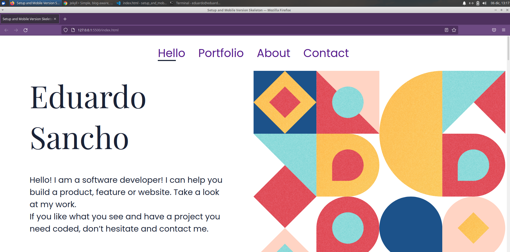

# SetUp and Mobile Version Skeleton

~~~
-Personal Portfolio based on Template #5 of Figma.
https://www.figma.com/file/l7SqJ3ZfkAKih9sFxvWSR4/Microverse-Student-Project-1?node-id=67%3A553
~~~

## Built With

- Major languages: HTML and CSS
## Getting Started

To get a local copy up and running follow these simple example steps.

1. Clone repository with git clone https://github.com/eduardosancho/setup_and_mobile_version_skeleton.git
2. Open index.html

## Authors

👤 **eduardosancho**

- GitHub: [@eduardosancho](https://github.com/eduardosancho)

## 🤝 Contributing

Contributions, issues, and feature requests are welcome!

Feel free to check the [issues page](../../issues/).

## Show your support

Give a ⭐️ if you like this project!

## Acknowledgments

- Hat tip to anyone whose code was used
- Inspiration
- etc

## 📝 License

This project is [MIT](./MIT.md) licensed.
